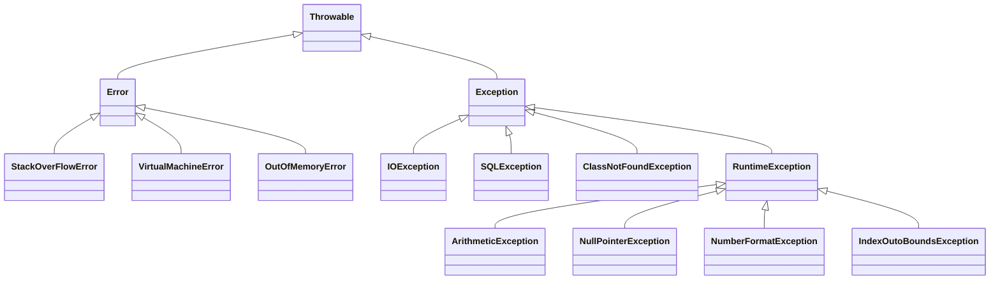

# Exception

### Checked Exception

The classes that directly inherit the Throwable class except RuntimeException and Error are known as checked exceptions. For example, IOException, SQLException, etc. Checked exceptions are checked at compile-time.

### Unchecked Exception

The classes that inherit the RuntimeException are known as unchecked exceptions. For example, ArithmeticException, NullPointerException, ArrayIndexOutOfBoundsException, etc. Unchecked exceptions are not checked at compile-time, but they are checked at runtime.

## Java Exception Keywords

- The `try` keyword is used to specify a block where we should place an exception code. It means we can't use try block alone. The try block must be followed by either catch or finally.
- `catch` block is used to handle the exception. It must be preceded by try block which means we can't use catch block alone. It can be followed by finally block later.
- `finally` block is used to execute the necessary code of the program. It is executed whether an exception is handled or not.
- `throw` keyword is used to throw an exception.
- `throws` keyword is used to declare exceptions. It specifies that there may occur an exception in the method. It doesn't throw an exception. It is always used with method signature.

## Notes 
- `try` must create with catch or finally

