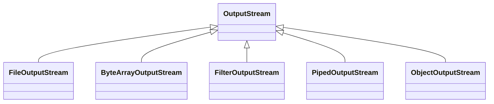
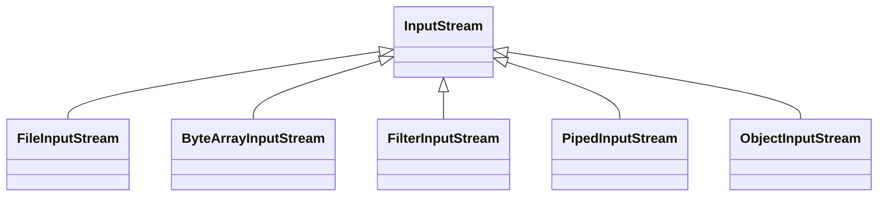

# I/O 
##### There is two main abstrcat class in java I/O 
- ##### OutputStream
- ##### InputStream

### Streams can be classified into two categories:
- Low Level Streams [Byets, Characters]
    - FileInputStream, FileOutputStream
    -  FileReader, FileWriter
    -  RandomAccessFile

- High Level Streams [Int, string , float]
    -  DataInputStream , DataOutputStream

### Low level
- A Low Level Stream is a stream that is attached directly to
the source/destination.
- It can only deal with raw data in the form of bytes or
characters.

### High level
- A High Level Stream is a stream that is attached to a lower
level stream (i.e. layered over it).
- It can deal with higher data types such as int, float, String, or
even whole objects.
- A High Level Stream saves some conversion effort for the
programmer. (e.g. Reading complete Strings instead of
reading character by character then transferring them into a
String).

